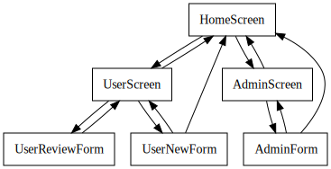

# Power App Documentation \- HelpDesk

| Property                   | Value                                    |
| -------------------------- | ---------------------------------------- |
| App Name                   | HelpDesk                                 |
| App Logo                   |   |
| Documentation generated at | domingo, 30 de abril de 2023 02:44 p. m. |

- [Overview](index-HelpDesk.md)
- [App Details](appdetails-HelpDesk.md)
- [Variables](variables-HelpDesk.md)
- [DataSources](datasources-HelpDesk.md)
- [Resources](resources-HelpDesk.md)
- [Controls](controls-HelpDesk.md)

## Controls Overview

A total of 6 Screens are located in the app.

A total of 286 Controls are located in the app.

### [Screen: AdminForm](screen-AdminForm-HelpDesk.md)

- [ AdminForm](screen-AdminForm-HelpDesk.md)
- - [ ContainerPage\_4](screen-AdminForm-HelpDesk.md)
  - - [ ContainerFooter\_8](screen-AdminForm-HelpDesk.md)
    - - [ ContainerLeft\_8](screen-AdminForm-HelpDesk.md)
      - - [ ButtonReturn\_5](screen-AdminForm-HelpDesk.md)
  - - [ ContainerHeader\_7](screen-AdminForm-HelpDesk.md)
    - - [ HeaderApp\_4](screen-AdminForm-HelpDesk.md)
      - - [ HeaderTitleName\_9](screen-AdminForm-HelpDesk.md)
    - - [ HeaderTitle\_7](screen-AdminForm-HelpDesk.md)
      - - [ HeaderTitleLogo\_4](screen-AdminForm-HelpDesk.md)
      - - [ HeaderTitleName\_8](screen-AdminForm-HelpDesk.md)
    - - [ HeaderUser\_8](screen-AdminForm-HelpDesk.md)
      - - [ HeaderUserImage\_5](screen-AdminForm-HelpDesk.md)
      - - [ HeaderUserName\_5](screen-AdminForm-HelpDesk.md)
  - - [ ContainerInferior\_4](screen-AdminForm-HelpDesk.md)
    - - [ FormAdmin](screen-AdminForm-HelpDesk.md)
      - - [ Area de reporte\_DataCard1\_1](screen-AdminForm-HelpDesk.md)
        - - [ DataCardKey3\_1](screen-AdminForm-HelpDesk.md)
        - - [ DataCardValue3\_1](screen-AdminForm-HelpDesk.md)
        - - [ ErrorMessage3\_1](screen-AdminForm-HelpDesk.md)
        - - [ StarVisible3\_1](screen-AdminForm-HelpDesk.md)
      - - [ Comentarios\_DataCard1\_1](screen-AdminForm-HelpDesk.md)
        - - [ DataCardKey6\_1](screen-AdminForm-HelpDesk.md)
        - - [ DataCardValue6\_1](screen-AdminForm-HelpDesk.md)
        - - [ ErrorMessage6\_1](screen-AdminForm-HelpDesk.md)
        - - [ StarVisible6\_1](screen-AdminForm-HelpDesk.md)
      - - [ Creado por\_DataCard1](screen-AdminForm-HelpDesk.md)
        - - [ DataCardKey11](screen-AdminForm-HelpDesk.md)
        - - [ DataCardValue11](screen-AdminForm-HelpDesk.md)
        - - [ ErrorMessage10](screen-AdminForm-HelpDesk.md)
        - - [ StarVisible10](screen-AdminForm-HelpDesk.md)
      - - [ Creado\_DataCard1](screen-AdminForm-HelpDesk.md)
        - - [ DataCardKey10](screen-AdminForm-HelpDesk.md)
        - - [ DataCardValue10](screen-AdminForm-HelpDesk.md)
      - - [ DataCard4](screen-AdminForm-HelpDesk.md)
        - - [ Label4\_1](screen-AdminForm-HelpDesk.md)
      - - [ DataCard5](screen-AdminForm-HelpDesk.md)
        - - [ ButtonCreate\_4](screen-AdminForm-HelpDesk.md)
      - - [ Datos adjuntos\_DataCard1\_1](screen-AdminForm-HelpDesk.md)
        - - [ DataCardKey9\_1](screen-AdminForm-HelpDesk.md)
        - - [ DataCardValue9\_1](screen-AdminForm-HelpDesk.md)
        - - [ ErrorMessage9\_1](screen-AdminForm-HelpDesk.md)
        - - [ StarVisible9\_1](screen-AdminForm-HelpDesk.md)
      - - [ Descripción\_DataCard1\_1](screen-AdminForm-HelpDesk.md)
        - - [ DataCardKey2\_1](screen-AdminForm-HelpDesk.md)
        - - [ DataCardValue2\_1](screen-AdminForm-HelpDesk.md)
        - - [ ErrorMessage2\_1](screen-AdminForm-HelpDesk.md)
        - - [ StarVisible2\_1](screen-AdminForm-HelpDesk.md)
      - - [ Estado de ticket\_DataCard1\_1](screen-AdminForm-HelpDesk.md)
        - - [ ComboBox1](screen-AdminForm-HelpDesk.md)
        - - [ DataCardKey5\_1](screen-AdminForm-HelpDesk.md)
        - - [ ErrorMessage5\_1](screen-AdminForm-HelpDesk.md)
        - - [ StarVisible5\_1](screen-AdminForm-HelpDesk.md)
      - - [ Prioridad\_DataCard1\_1](screen-AdminForm-HelpDesk.md)
        - - [ ComboBox1\_2](screen-AdminForm-HelpDesk.md)
        - - [ DataCardKey7\_1](screen-AdminForm-HelpDesk.md)
        - - [ ErrorMessage7\_1](screen-AdminForm-HelpDesk.md)
        - - [ StarVisible7\_1](screen-AdminForm-HelpDesk.md)
      - - [ Responsable\_DataCard1\_1](screen-AdminForm-HelpDesk.md)
        - - [ ComboBox1\_1](screen-AdminForm-HelpDesk.md)
        - - [ DataCardKey4\_1](screen-AdminForm-HelpDesk.md)
        - - [ ErrorMessage4\_1](screen-AdminForm-HelpDesk.md)
        - - [ StarVisible4\_1](screen-AdminForm-HelpDesk.md)
      - - [ Tiempo estimado de respuesta\_DataCard1\_1](screen-AdminForm-HelpDesk.md)
        - - [ ComboBox1\_3](screen-AdminForm-HelpDesk.md)
        - - [ DataCardKey8\_1](screen-AdminForm-HelpDesk.md)
        - - [ ErrorMessage8\_1](screen-AdminForm-HelpDesk.md)
        - - [ StarVisible8\_1](screen-AdminForm-HelpDesk.md)
      - - [ Título\_DataCard1\_1](screen-AdminForm-HelpDesk.md)
        - - [ DataCardKey1\_1](screen-AdminForm-HelpDesk.md)
        - - [ DataCardValue1\_1](screen-AdminForm-HelpDesk.md)
        - - [ ErrorMessage1\_1](screen-AdminForm-HelpDesk.md)
    - - [ Label3\_1](screen-AdminForm-HelpDesk.md)

### [Screen: AdminScreen](screen-AdminScreen-HelpDesk.md)

- [ AdminScreen](screen-AdminScreen-HelpDesk.md)
- - [ ContainerPage\_3](screen-AdminScreen-HelpDesk.md)
  - - [ Containerfooter\_6](screen-AdminScreen-HelpDesk.md)
    - - [ ContainerLeft\_6](screen-AdminScreen-HelpDesk.md)
      - - [ ButtonReturn\_4](screen-AdminScreen-HelpDesk.md)
  - - [ ContainerHeader\_5](screen-AdminScreen-HelpDesk.md)
    - - [ HeaderApp\_3](screen-AdminScreen-HelpDesk.md)
      - - [ HeaderTitleName\_7](screen-AdminScreen-HelpDesk.md)
    - - [ HeaderTitle\_5](screen-AdminScreen-HelpDesk.md)
      - - [ HeaderTitleLogo\_3](screen-AdminScreen-HelpDesk.md)
      - - [ HeaderTitleName\_6](screen-AdminScreen-HelpDesk.md)
    - - [ HeaderUser\_6](screen-AdminScreen-HelpDesk.md)
      - - [ HeaderUserImage\_4](screen-AdminScreen-HelpDesk.md)
      - - [ HeaderUserName\_4](screen-AdminScreen-HelpDesk.md)
  - - [ ContainerInferior\_3](screen-AdminScreen-HelpDesk.md)
    - - [ ContainerMain\_2](screen-AdminScreen-HelpDesk.md)
      - - [ AdminFilter](screen-AdminScreen-HelpDesk.md)
        - - [ ButtonFilter\_2](screen-AdminScreen-HelpDesk.md)
        - - [ galleryTemplate1\_1](screen-AdminScreen-HelpDesk.md)
      - - [ AdminGallery](screen-AdminScreen-HelpDesk.md)
        - - [ Fecha\_1](screen-AdminScreen-HelpDesk.md)
        - - [ Fecha\_2](screen-AdminScreen-HelpDesk.md)
        - - [ Fecha\_3](screen-AdminScreen-HelpDesk.md)
        - - [ galleryTemplate4\_1](screen-AdminScreen-HelpDesk.md)
        - - [ ID\_1](screen-AdminScreen-HelpDesk.md)
        - - [ LabelEstado\_1](screen-AdminScreen-HelpDesk.md)
        - - [ LabelFecha\_1](screen-AdminScreen-HelpDesk.md)
        - - [ LabelFecha\_2](screen-AdminScreen-HelpDesk.md)
        - - [ LabelFecha\_3](screen-AdminScreen-HelpDesk.md)
        - - [ LabelID\_1](screen-AdminScreen-HelpDesk.md)
        - - [ LabelTitulo\_1](screen-AdminScreen-HelpDesk.md)
        - - [ RectangleBack\_1](screen-AdminScreen-HelpDesk.md)
        - - [ RectangleMask\_3](screen-AdminScreen-HelpDesk.md)
        - - [ Titulo\_1](screen-AdminScreen-HelpDesk.md)

### [Screen: HomeScreen](screen-HomeScreen-HelpDesk.md)

- [ HomeScreen](screen-HomeScreen-HelpDesk.md)
- - [ ContainerPage](screen-HomeScreen-HelpDesk.md)
  - - [ ContainerHeader](screen-HomeScreen-HelpDesk.md)
    - - [ HeaderApp](screen-HomeScreen-HelpDesk.md)
      - - [ HeaderTitleName\_1](screen-HomeScreen-HelpDesk.md)
    - - [ HeaderTitle](screen-HomeScreen-HelpDesk.md)
      - - [ HeaderTitleLogo](screen-HomeScreen-HelpDesk.md)
      - - [ HeaderTitleName](screen-HomeScreen-HelpDesk.md)
    - - [ HeaderUser\_1](screen-HomeScreen-HelpDesk.md)
      - - [ HeaderUserImage\_1](screen-HomeScreen-HelpDesk.md)
      - - [ HeaderUserName\_1](screen-HomeScreen-HelpDesk.md)
  - - [ ContainerInferior](screen-HomeScreen-HelpDesk.md)
    - - [ ContainerMain](screen-HomeScreen-HelpDesk.md)
      - - [ Container5](screen-HomeScreen-HelpDesk.md)
        - - [ Image1](screen-HomeScreen-HelpDesk.md)
      - - [ Container6](screen-HomeScreen-HelpDesk.md)
        - - [ Button1](screen-HomeScreen-HelpDesk.md)
        - - [ Button2](screen-HomeScreen-HelpDesk.md)
        - - [ Label1](screen-HomeScreen-HelpDesk.md)
        - - [ Label2](screen-HomeScreen-HelpDesk.md)
        - - [ Rectangle1](screen-HomeScreen-HelpDesk.md)

### [Screen: UserNewForm](screen-UserNewForm-HelpDesk.md)

- [ UserNewForm](screen-UserNewForm-HelpDesk.md)
- - [ ContainerPage\_2](screen-UserNewForm-HelpDesk.md)
  - - [ ContainerFooter\_3](screen-UserNewForm-HelpDesk.md)
    - - [ ContainerLeft\_1](screen-UserNewForm-HelpDesk.md)
      - - [ ButtonReturn\_3](screen-UserNewForm-HelpDesk.md)
  - - [ ContainerHeader\_3](screen-UserNewForm-HelpDesk.md)
    - - [ HeaderApp\_2](screen-UserNewForm-HelpDesk.md)
      - - [ HeaderTitleName\_5](screen-UserNewForm-HelpDesk.md)
    - - [ HeaderTitle\_3](screen-UserNewForm-HelpDesk.md)
      - - [ HeaderTitleLogo\_2](screen-UserNewForm-HelpDesk.md)
      - - [ HeaderTitleName\_4](screen-UserNewForm-HelpDesk.md)
    - - [ HeaderUser\_4](screen-UserNewForm-HelpDesk.md)
      - - [ HeaderUserImage\_3](screen-UserNewForm-HelpDesk.md)
      - - [ HeaderUserName\_3](screen-UserNewForm-HelpDesk.md)
  - - [ ContainerInferior\_2](screen-UserNewForm-HelpDesk.md)
    - - [ FormNew](screen-UserNewForm-HelpDesk.md)
      - - [ Area de reporte\_DataCard1](screen-UserNewForm-HelpDesk.md)
        - - [ DataCardKey3](screen-UserNewForm-HelpDesk.md)
        - - [ DataCardValue3](screen-UserNewForm-HelpDesk.md)
        - - [ ErrorMessage3](screen-UserNewForm-HelpDesk.md)
        - - [ StarVisible3](screen-UserNewForm-HelpDesk.md)
      - - [ Comentarios\_DataCard1](screen-UserNewForm-HelpDesk.md)
        - - [ DataCardKey6](screen-UserNewForm-HelpDesk.md)
        - - [ DataCardValue6](screen-UserNewForm-HelpDesk.md)
        - - [ ErrorMessage6](screen-UserNewForm-HelpDesk.md)
        - - [ StarVisible6](screen-UserNewForm-HelpDesk.md)
      - - [ DataCard1](screen-UserNewForm-HelpDesk.md)
        - - [ ButtonCreate\_3](screen-UserNewForm-HelpDesk.md)
      - - [ Datos adjuntos\_DataCard1](screen-UserNewForm-HelpDesk.md)
        - - [ DataCardKey9](screen-UserNewForm-HelpDesk.md)
        - - [ DataCardValue9](screen-UserNewForm-HelpDesk.md)
        - - [ ErrorMessage9](screen-UserNewForm-HelpDesk.md)
        - - [ StarVisible9](screen-UserNewForm-HelpDesk.md)
      - - [ Descripción\_DataCard1](screen-UserNewForm-HelpDesk.md)
        - - [ DataCardKey2](screen-UserNewForm-HelpDesk.md)
        - - [ DataCardValue2](screen-UserNewForm-HelpDesk.md)
        - - [ ErrorMessage2](screen-UserNewForm-HelpDesk.md)
        - - [ StarVisible2](screen-UserNewForm-HelpDesk.md)
      - - [ Estado de ticket\_DataCard1](screen-UserNewForm-HelpDesk.md)
        - - [ DataCardKey5](screen-UserNewForm-HelpDesk.md)
        - - [ DataCardValue5](screen-UserNewForm-HelpDesk.md)
        - - [ ErrorMessage5](screen-UserNewForm-HelpDesk.md)
        - - [ StarVisible5](screen-UserNewForm-HelpDesk.md)
      - - [ Prioridad\_DataCard1](screen-UserNewForm-HelpDesk.md)
        - - [ DataCardKey7](screen-UserNewForm-HelpDesk.md)
        - - [ DataCardValue7](screen-UserNewForm-HelpDesk.md)
        - - [ ErrorMessage7](screen-UserNewForm-HelpDesk.md)
        - - [ StarVisible7](screen-UserNewForm-HelpDesk.md)
      - - [ Responsable\_DataCard1](screen-UserNewForm-HelpDesk.md)
        - - [ DataCardKey4](screen-UserNewForm-HelpDesk.md)
        - - [ DataCardValue4](screen-UserNewForm-HelpDesk.md)
        - - [ ErrorMessage4](screen-UserNewForm-HelpDesk.md)
        - - [ StarVisible4](screen-UserNewForm-HelpDesk.md)
      - - [ Tiempo estimado de respuesta\_DataCard1](screen-UserNewForm-HelpDesk.md)
        - - [ DataCardKey8](screen-UserNewForm-HelpDesk.md)
        - - [ DataCardValue8](screen-UserNewForm-HelpDesk.md)
        - - [ ErrorMessage8](screen-UserNewForm-HelpDesk.md)
        - - [ StarVisible8](screen-UserNewForm-HelpDesk.md)
      - - [ Título\_DataCard1](screen-UserNewForm-HelpDesk.md)
        - - [ DataCardKey1](screen-UserNewForm-HelpDesk.md)
        - - [ DataCardValue1](screen-UserNewForm-HelpDesk.md)
        - - [ ErrorMessage1](screen-UserNewForm-HelpDesk.md)
    - - [ LabelUpper](screen-UserNewForm-HelpDesk.md)

### [Screen: UserReviewForm](screen-UserReviewForm-HelpDesk.md)

- [ UserReviewForm](screen-UserReviewForm-HelpDesk.md)
- - [ ContainerPage\_5](screen-UserReviewForm-HelpDesk.md)
  - - [ ContainerFooter\_10](screen-UserReviewForm-HelpDesk.md)
    - - [ ContainerLeft\_10](screen-UserReviewForm-HelpDesk.md)
      - - [ ButtonReturn\_6](screen-UserReviewForm-HelpDesk.md)
  - - [ ContainerHeader\_9](screen-UserReviewForm-HelpDesk.md)
    - - [ HeaderApp\_5](screen-UserReviewForm-HelpDesk.md)
      - - [ HeaderTitleName\_11](screen-UserReviewForm-HelpDesk.md)
    - - [ HeaderTitle\_9](screen-UserReviewForm-HelpDesk.md)
      - - [ HeaderTitleLogo\_5](screen-UserReviewForm-HelpDesk.md)
      - - [ HeaderTitleName\_10](screen-UserReviewForm-HelpDesk.md)
    - - [ HeaderUser\_10](screen-UserReviewForm-HelpDesk.md)
      - - [ HeaderUserImage\_6](screen-UserReviewForm-HelpDesk.md)
      - - [ HeaderUserName\_6](screen-UserReviewForm-HelpDesk.md)
  - - [ ContainerInferior\_5](screen-UserReviewForm-HelpDesk.md)
    - - [ FormReview](screen-UserReviewForm-HelpDesk.md)
      - - [ Comentarios\_DataCard1\_2](screen-UserReviewForm-HelpDesk.md)
        - - [ DataCardKey6\_2](screen-UserReviewForm-HelpDesk.md)
        - - [ DataCardValue6\_2](screen-UserReviewForm-HelpDesk.md)
        - - [ ErrorMessage6\_2](screen-UserReviewForm-HelpDesk.md)
        - - [ StarVisible6\_2](screen-UserReviewForm-HelpDesk.md)
      - - [ Creado\_DataCard1\_1](screen-UserReviewForm-HelpDesk.md)
        - - [ DataCardKey10\_1](screen-UserReviewForm-HelpDesk.md)
        - - [ DataCardValue10\_1](screen-UserReviewForm-HelpDesk.md)
      - - [ DataCard2](screen-UserReviewForm-HelpDesk.md)
        - - [ Label4](screen-UserReviewForm-HelpDesk.md)
      - - [ DataCard3](screen-UserReviewForm-HelpDesk.md)
      - - [ Datos adjuntos\_DataCard1\_2](screen-UserReviewForm-HelpDesk.md)
        - - [ DataCardKey9\_2](screen-UserReviewForm-HelpDesk.md)
        - - [ DataCardValue9\_2](screen-UserReviewForm-HelpDesk.md)
        - - [ ErrorMessage9\_2](screen-UserReviewForm-HelpDesk.md)
        - - [ StarVisible9\_2](screen-UserReviewForm-HelpDesk.md)
      - - [ Descripción\_DataCard1\_2](screen-UserReviewForm-HelpDesk.md)
        - - [ DataCardKey2\_2](screen-UserReviewForm-HelpDesk.md)
        - - [ DataCardValue2\_2](screen-UserReviewForm-HelpDesk.md)
        - - [ ErrorMessage2\_2](screen-UserReviewForm-HelpDesk.md)
        - - [ StarVisible2\_2](screen-UserReviewForm-HelpDesk.md)
      - - [ Estado de ticket\_DataCard1\_2](screen-UserReviewForm-HelpDesk.md)
        - - [ DataCardKey5\_2](screen-UserReviewForm-HelpDesk.md)
        - - [ DataCardValue5\_2](screen-UserReviewForm-HelpDesk.md)
        - - [ ErrorMessage5\_2](screen-UserReviewForm-HelpDesk.md)
        - - [ StarVisible5\_2](screen-UserReviewForm-HelpDesk.md)
      - - [ Prioridad\_DataCard1\_2](screen-UserReviewForm-HelpDesk.md)
        - - [ DataCardKey7\_2](screen-UserReviewForm-HelpDesk.md)
        - - [ DataCardValue7\_2](screen-UserReviewForm-HelpDesk.md)
        - - [ ErrorMessage7\_2](screen-UserReviewForm-HelpDesk.md)
        - - [ StarVisible7\_2](screen-UserReviewForm-HelpDesk.md)
      - - [ Responsable\_DataCard1\_2](screen-UserReviewForm-HelpDesk.md)
        - - [ DataCardKey4\_2](screen-UserReviewForm-HelpDesk.md)
        - - [ DataCardValue4\_2](screen-UserReviewForm-HelpDesk.md)
        - - [ ErrorMessage4\_2](screen-UserReviewForm-HelpDesk.md)
        - - [ StarVisible4\_2](screen-UserReviewForm-HelpDesk.md)
      - - [ Tiempo estimado de respuesta\_DataCard1\_2](screen-UserReviewForm-HelpDesk.md)
        - - [ DataCardKey8\_2](screen-UserReviewForm-HelpDesk.md)
        - - [ DataCardValue8\_2](screen-UserReviewForm-HelpDesk.md)
        - - [ ErrorMessage8\_2](screen-UserReviewForm-HelpDesk.md)
        - - [ StarVisible8\_2](screen-UserReviewForm-HelpDesk.md)
      - - [ Título\_DataCard1\_2](screen-UserReviewForm-HelpDesk.md)
        - - [ DataCardKey1\_2](screen-UserReviewForm-HelpDesk.md)
        - - [ DataCardValue1\_2](screen-UserReviewForm-HelpDesk.md)
        - - [ ErrorMessage1\_2](screen-UserReviewForm-HelpDesk.md)
    - - [ LabelUpper\_2](screen-UserReviewForm-HelpDesk.md)

### [Screen: UserScreen](screen-UserScreen-HelpDesk.md)

- [ UserScreen](screen-UserScreen-HelpDesk.md)
- - [ ContainerPage\_1](screen-UserScreen-HelpDesk.md)
  - - [ ContainerFooter\_2](screen-UserScreen-HelpDesk.md)
    - - [ ContainerLeft\_2](screen-UserScreen-HelpDesk.md)
      - - [ ButtonReturn\_2](screen-UserScreen-HelpDesk.md)
    - - [ ContainerRight\_2](screen-UserScreen-HelpDesk.md)
      - - [ ButtonCreate\_1](screen-UserScreen-HelpDesk.md)
  - - [ ContainerHeader\_1](screen-UserScreen-HelpDesk.md)
    - - [ HeaderApp\_1](screen-UserScreen-HelpDesk.md)
      - - [ HeaderTitleName\_3](screen-UserScreen-HelpDesk.md)
    - - [ HeaderTitle\_1](screen-UserScreen-HelpDesk.md)
      - - [ HeaderTitleLogo\_1](screen-UserScreen-HelpDesk.md)
      - - [ HeaderTitleName\_2](screen-UserScreen-HelpDesk.md)
    - - [ HeaderUser\_2](screen-UserScreen-HelpDesk.md)
      - - [ HeaderUserImage\_2](screen-UserScreen-HelpDesk.md)
      - - [ HeaderUserName\_2](screen-UserScreen-HelpDesk.md)
  - - [ ContainerInferior\_1](screen-UserScreen-HelpDesk.md)
    - - [ ContainerMain\_1](screen-UserScreen-HelpDesk.md)
      - - [ AdminFilter\_1](screen-UserScreen-HelpDesk.md)
        - - [ ButtonFilter](screen-UserScreen-HelpDesk.md)
        - - [ galleryTemplate1\_2](screen-UserScreen-HelpDesk.md)
      - - [ UserGallery](screen-UserScreen-HelpDesk.md)
        - - [ Fecha\_4](screen-UserScreen-HelpDesk.md)
        - - [ galleryTemplate4\_2](screen-UserScreen-HelpDesk.md)
        - - [ ID\_2](screen-UserScreen-HelpDesk.md)
        - - [ LabelEstado\_2](screen-UserScreen-HelpDesk.md)
        - - [ LabelFecha\_4](screen-UserScreen-HelpDesk.md)
        - - [ LabelID\_2](screen-UserScreen-HelpDesk.md)
        - - [ LabelTitulo\_2](screen-UserScreen-HelpDesk.md)
        - - [ RectangleBack](screen-UserScreen-HelpDesk.md)
        - - [ RectangleMask](screen-UserScreen-HelpDesk.md)
        - - [ Titulo\_2](screen-UserScreen-HelpDesk.md)

## Screen Navigation

The following diagram shows the navigation between the different screens.

